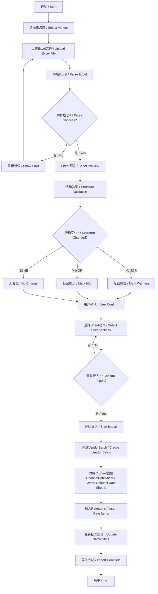
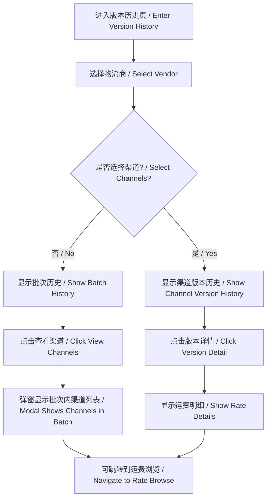
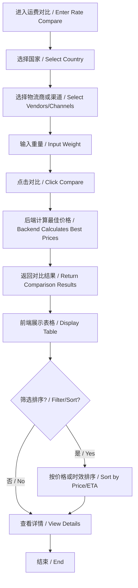
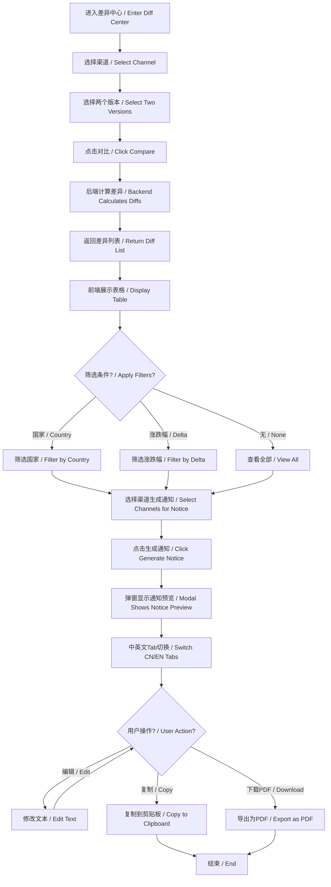
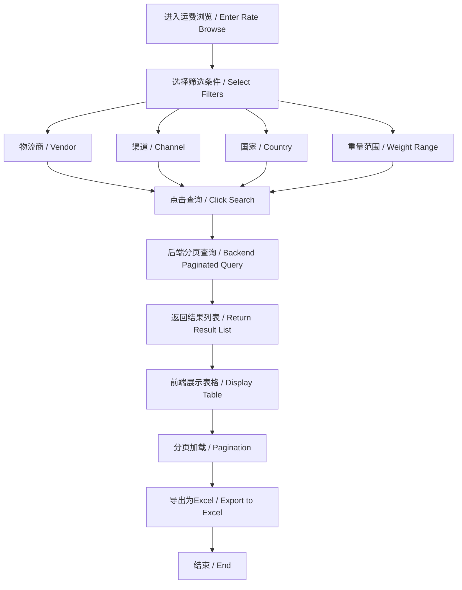

# 业务流程文档 / Workflow Documentation

## 概述 / Overview

本文档描述运费管理系统的核心业务流程，包括运费导入、版本管理、差异对比和通知生成等功能模块。

This document describes the core business workflows of the freight management system, including rate import, version management, diff comparison, and notice generation.

---

## 目录 / Table of Contents

1. [运费导入流程](#1-运费导入流程--rate-import-workflow)
2. [版本历史管理](#2-版本历史管理--version-history-management)
3. [运费对比流程](#3-运费对比流程--rate-comparison-workflow)
4. [差异中心流程](#4-差异中心流程--rate-diff-center-workflow)
5. [通知生成流程](#5-通知生成流程--notice-generation-workflow)
6. [运费查询流程](#6-运费查询流程--rate-browse-workflow)

---

## 1. 运费导入流程 / Rate Import Workflow

### 流程图 / Flow Diagram



### 步骤详解 / Step-by-Step

#### Step 1: 上传文件 (Upload)

**页面:** `/rates/import` - Step 1

**操作:**
1. 用户选择物流商（Vendor）
2. 拖拽或点击上传Excel文件（.xlsx或.xls）
3. 系统验证文件格式

**前端组件:** `UploadStep.tsx`

**状态管理:**
```typescript
// useImportStore
{
  selectedVendorId: number,
  uploadFileName: string,
  uploadedBy: string
}
```

**API调用:** 无（纯前端解析）

---

#### Step 2: 解析预览 (Parse Preview)

**页面:** `/rates/import` - Step 2

**操作:**
1. 使用 `xlsx` 库解析Excel文件
2. 遍历所有Sheet，识别类型（RATE_CARD/FUEL/REMOTE/OTHER）
3. 提取关键信息：
   - `channelCode` (渠道代码)
   - `effectiveDate` (生效日期)
   - `currency` (币种)
   - `notes` (备注)
4. 进行智能检测（Detection）：
   - **headerSignal**: 查找"渠道"、"产品名"、"生效日期"等关键字
   - **columnSignal**: 匹配"国家"、"重量"、"价格"等列
   - **weightSignal**: 识别重量格式（如"0-0.5kg"）
5. 计算 `detectionScore` 和 `detectionVerdict` (rate/uncertain/skipped)

**前端组件:** `ParsePreviewStep.tsx`

**状态更新:**
```typescript
setParsedSheets([
  {
    sheetName: "云途全球专线挂号",
    sheetType: "RATE_CARD",
    channelCode: "YUN_GLOBAL_REG",
    effectiveDate: "2025-10-20",
    detectionScore: 85,
    detectionVerdict: "rate",
    rows: [...],
    rateCardDetails: [...],
    action: "import" // 默认
  }
])
```

**解析逻辑:** `src/services/excelParser.ts`

---

#### Step 3: 结构验证 (Structure Validation)

**页面:** `/rates/import` - Step 3

**操作:**
1. 对于识别为 `RATE_CARD` 的Sheet，检查历史结构
2. 从 `localStorage` 读取历史结构：
   ```typescript
   const key = `channelStructure:${vendorCode}:${channelCode}`;
   const history = JSON.parse(localStorage.getItem(key));
   ```
3. 对比当前结构与历史结构：
   - **列名变化**: 缺失列、新增列、顺序变化
   - **数据格式变化**: 重量格式、价格格式、国家代码
4. 判定变化等级：
   - **MAJOR**: 缺失关键列（country, price）、数据格式完全不同
   - **MINOR**: 新增列、列顺序变化、字段细微变化
   - **NONE**: 无变化或首次导入
5. 生成 `structureChangeMessage`

**前端组件:** `StructureValidationStep.tsx`

**变化示例:**
```
MAJOR Changes:
- Missing critical column: [price]
- Country format changed: "CN" → "China"

MINOR Changes:
+ New column detected: [registerFee]
→ Column order changed: [zone] moved
```

**存储逻辑:**
```typescript
localStorage.setItem(key, JSON.stringify({
  columns: ["country", "zone", "weightFrom", "weightTo", "price"],
  formats: { weight: "0-0.5", country: "code" },
  lastUpdated: new Date().toISOString()
}));
```

---

#### Step 4: 确认动作 (Confirm Actions)

**页面:** `/rates/import` - Step 4

**操作:**
1. 展示所有Sheet及其验证结果
2. 用户为每个Sheet选择动作：
   - ✅ **Import**: 导入此Sheet
   - ⏭️ **Skip**: 跳过此Sheet
3. 显示汇总信息：
   - 总Sheet数
   - 待导入数
   - 跳过数
   - 警告数
4. 用户可添加批注（Notes）

**前端组件:** `ConfirmActionsStep.tsx`

**状态更新:**
```typescript
updateSheetAction(sheetName, 'import' | 'skip');
```

**UI元素:**
- Sheet列表（Table）
- 动作选择器（Select）
- 结构变化徽章（Badge）
- 全局备注输入（TextArea）

---

#### Step 5: 执行导入 (Import Progress)

**页面:** `/rates/import` - Step 5

**操作:**
1. 创建 `ImportJob`（可选，用于审计）
2. **创建 VendorBatch**:
   ```typescript
   const batch = await api.post('/api/import/batches', {
     vendorId: selectedVendorId,
     fileName: uploadFileName,
     uploadedBy: 'admin',
     effectiveDate: '2025-10-20',
     totalChannels: 0, // 初始值
     notes: '本次更新欧洲区价格'
   });
   ```
3. **为每个Sheet导入数据**:
   ```typescript
   for (const sheet of parsedSheets) {
     if (sheet.action !== 'import') continue;
     
     // 创建ChannelRateSheet
     const rateSheet = await api.post('/api/channel-rate-sheets', {
       channelId: getChannelId(sheet.channelCode),
       batchId: batch.id,
       versionCode: `v${new Date().toISOString().slice(0,10).replace(/-/g,'')}`,
       effectiveDate: sheet.effectiveDate,
       fileName: uploadFileName,
       uploadedBy: 'admin',
       status: 'active'
     });
     
     // 批量插入RateItems
     await api.post('/api/channel-rate-items/batch', {
       sheetId: rateSheet.id,
       items: sheet.rateCardDetails.map(row => ({
         country: row.country,
         zone: row.zone,
         weightFrom: row.weightFrom,
         weightTo: row.weightTo,
         price: row.price,
         currency: sheet.currency || 'USD',
         eta: row.eta
       }))
     });
   }
   ```
4. **更新批次统计**:
   ```typescript
   await api.patch(`/api/import/batches/${batch.id}`, {
     totalChannels: importedSheetCount
   });
   ```
5. 显示进度条和成功/失败状态

**前端组件:** `ImportProgressStep.tsx`

**进度状态:**
```typescript
{
  totalSheets: 10,
  processedSheets: 5,
  successCount: 4,
  failedCount: 1,
  currentSheet: "云途全球专线挂号",
  errors: [{ sheetName: "Sheet2", error: "Invalid data format" }]
}
```

**API Endpoints:**
- `POST /api/import/batches` - 创建批次
- `POST /api/channel-rate-sheets` - 创建版本
- `POST /api/channel-rate-items/batch` - 批量插入明细
- `PATCH /api/import/batches/{id}` - 更新批次

---

## 2. 版本历史管理 / Version History Management

### 流程图 / Flow Diagram



### 批次历史视图 (Batch History View)

**页面:** `/rates/history` (无渠道选择)

**功能:**
1. 显示所选物流商的所有上传批次
2. 表格列：
   - 上传时间 (Uploaded At)
   - 文件名 (File Name)
   - 上传人 (Uploaded By)
   - 总渠道数 (Total Channels)
   - 生效日期 (Effective Date)
   - 备注 (Notes)
   - 操作 (Actions: 查看渠道)

**API调用:**
```typescript
GET /api/version/batches?vendorId=1

// Response
[
  {
    id: 1,
    vendorId: 1,
    fileName: "云途报价20251020.xlsx",
    uploadedBy: "admin",
    uploadedAt: "2025-10-20T08:30:00Z",
    effectiveDate: "2025-10-21",
    totalChannels: 22,
    notes: "调整欧洲区价格"
  }
]
```

### 渠道版本历史视图 (Channel Version History View)

**页面:** `/rates/history?channelId=10,11`

**功能:**
1. 显示所选渠道的所有版本记录
2. 表格列：
   - 渠道名 (Channel Name)
   - 版本号 (Version Code)
   - 批次文件名 (Batch File)
   - 上传时间 (Uploaded At)
   - 生效日期 (Effective Date)
   - 状态 (Status)
   - 操作 (Actions: 查看详情、对比)

**API调用:**
```typescript
GET /api/version/channels?channelIds=10,11

// Response
[
  {
    id: 100,
    channelId: 10,
    channelName: "云途全球专线挂号(带电)",
    batchId: 5,
    batchFileName: "云途报价20251020.xlsx",
    versionCode: "v20251020",
    effectiveDate: "2025-10-21",
    uploadedAt: "2025-10-20T08:30:00Z",
    status: "active"
  }
]
```

### 批次渠道详情弹窗 (Batch Channels Modal)

**触发:** 点击"查看渠道"按钮

**功能:**
1. 弹窗显示该批次包含的所有渠道
2. 表格列：
   - 渠道名 (Channel Name)
   - 版本号 (Version Code)
   - 生效日期 (Effective Date)
   - 明细条数 (Item Count)
   - 操作 (Actions: 跳转到运费浏览)

**API调用:**
```typescript
GET /api/version/batches/5/channels

// Response
[
  {
    channelId: 10,
    channelName: "云途全球专线挂号(带电)",
    versionCode: "v20251020",
    effectiveDate: "2025-10-21",
    itemCount: 450
  }
]
```

---

## 3. 运费对比流程 / Rate Comparison Workflow

### 流程图 / Flow Diagram



### 操作步骤 / Steps

**页面:** `/rates/compare`

**功能:**
1. **筛选条件:**
   - 国家 (Country) - 必选
   - 物流商 (Vendors) - 多选
   - 渠道 (Channels) - 多选
   - 目标重量 (Target Weight) - 可选
   - 重量区间 (Weight Bracket) - 可选
   - 排序方式 (Sort By) - Price/ETA

2. **对比逻辑:**
   - 对于每个选中的渠道，查找对应国家的价格段
   - 如果指定目标重量，匹配该重量所在区间
   - 如果指定重量区间，返回该区间的价格
   - 计算总价 (包含挂号费)
   - 标记最佳价格 (isBest=true)

3. **显示结果:**
   - 表格展示各渠道的价格、时效
   - 高亮显示最佳选择（最低价、最快时效）
   - 支持导出为Excel或CSV

**API调用:**
```typescript
POST /api/rates/compare

// Request
{
  country: "US",
  vendorIds: [1, 2],
  channelIds: [10, 11, 12],
  targetWeight: 0.8,
  sortBy: "PRICE"
}

// Response
[
  {
    channelId: 10,
    channelName: "云途全球专线挂号(带电)",
    channelCode: "YUN_GLOBAL_REG_BATTERY",
    vendorId: 1,
    vendorName: "YunExpress",
    country: "US",
    matchedBracket: "0.5-1.0kg",
    minChargeableWeight: 0.5,
    price: 45.00,
    registerFee: 5.00,
    totalPrice: 50.00,
    eta: "7-10天",
    etaMin: 7,
    isBest: true,
    currency: "USD"
  }
]
```

---

## 4. 差异中心流程 / Rate Diff Center Workflow

### 流程图 / Flow Diagram



### 操作步骤 / Steps

#### 1. 选择对比版本

**页面:** `/rates/diff`

**操作:**
1. 选择渠道 (Channel) - 单选
2. 系统自动加载该渠道的版本列表
3. 选择旧版本 (Old Version)
4. 选择新版本 (New Version)
5. 点击"对比差异"按钮

**前端组件:**
```tsx
<Select value={selectedChannel} onChange={setSelectedChannel}>
  {channels.map(ch => <Option key={ch.id} value={ch.id}>{ch.name}</Option>)}
</Select>

<Select value={oldVersionId} onChange={setOldVersionId}>
  {versions.map(v => <Option key={v.id} value={v.id}>{v.versionCode}</Option>)}
</Select>

<Select value={newVersionId} onChange={setNewVersionId}>
  {versions.map(v => <Option key={v.id} value={v.id}>{v.versionCode}</Option>)}
</Select>

<Button onClick={handleCompare}>对比差异 / Compare</Button>
```

#### 2. 查看差异列表

**显示内容:**
- 差异表格，包含列：
  - 国家 (Country)
  - 区域 (Zone)
  - 重量段 (Weight Bracket)
  - 旧价格 (Old Price)
  - 新价格 (New Price)
  - 差额 (Delta)
  - 涨跌幅 (Delta %)
  - 标签 (Tag: 涨价/降价)

**筛选功能:**
- 按国家筛选
- 按涨跌幅范围筛选（>10%, <-10%）
- 只显示涨价/降价

**API调用:**
```typescript
GET /api/rates/diff?oldSheetId=100&newSheetId=101

// Response
[
  {
    id: 1,
    oldSheetId: 100,
    newSheetId: 101,
    channelId: 10,
    channelName: "云途全球专线挂号(带电)",
    country: "US",
    zone: "Zone1",
    weightFrom: 0.5,
    weightTo: 1.0,
    oldPrice: 45.00,
    newPrice: 48.00,
    delta: 3.00,
    deltaPct: 6.67
  }
]
```

#### 3. 生成通知

**触发:** 点击"生成通知"按钮

**前置条件:**
- 用户选中至少一个渠道的差异数据（可多选）

**后端逻辑:**
```typescript
POST /api/rates/diff/generate-notice

// Request
{
  channelIds: [10, 11],
  oldSheetId: 100,
  newSheetId: 101
}

// Response
{
  summaries: [
    {
      channelId: 10,
      channelName: "云途全球专线挂号(带电)",
      avgChangePct: 5.2,
      increaseCount: 120,
      decreaseCount: 30,
      maxIncreasePct: 15.0,
      maxDecreasePct: -8.5,
      effectiveDate: "2025-10-21",
      summaryLines: [
        "美国区域整体上涨约5.2%",
        "欧洲区域部分降价，最大降幅8.5%"
      ]
    }
  ]
}
```

**前端处理:**
```typescript
// 生成中文通知
const generateChineseNotice = (summaries) => `
【价格调整公告】

尊敬的客户您好：

由于物流商渠道价格调整，我司将于 ${summaries[0].effectiveDate} 起对以下渠道进行价格更新：

| 渠道 | 平均涨幅 | 涨价区间数 | 降价区间数 | 最大涨幅 | 最大降幅 |
|------|-----------|-------------|-------------|------------|------------|
${summaries.map(s => 
  `| ${s.channelName} | ${s.avgChangePct}% | ${s.increaseCount} | ${s.decreaseCount} | ${s.maxIncreasePct}% | ${s.maxDecreasePct}% |`
).join('\n')}

主要变化摘要：
${summaries.map(s => s.summaryLines.join('\n')).join('\n\n')}

如有疑问，请联系我司客服。

Airlyle Fulfillment
${new Date().toLocaleDateString('zh-CN')}
`;

// 生成英文通知
const generateEnglishNotice = (summaries) => `
[Rate Adjustment Notice]

Dear Valued Customer,

Due to carrier rate adjustments, the following channels will be updated effective ${summaries[0].effectiveDate}:

| Channel | Avg Change | Increases | Decreases | Max Increase | Max Decrease |
|---------|------------|-----------|-----------|--------------|--------------|
${summaries.map(s => 
  `| ${s.channelName} | ${s.avgChangePct}% | ${s.increaseCount} | ${s.decreaseCount} | ${s.maxIncreasePct}% | ${s.maxDecreasePct}% |`
).join('\n')}

Summary of Changes:
${summaries.map(s => s.summaryLines.join('\n')).join('\n\n')}

For questions, please contact our customer service.

Airlyle Fulfillment
${new Date().toLocaleDateString('en-US')}
`;
```

#### 4. 通知操作

**弹窗功能:**
1. **Tab切换**: 中文版 / 英文版
2. **文本编辑**: 用户可修改通知内容（使用 `<TextArea>` 组件）
3. **复制到剪贴板**:
   ```typescript
   const handleCopy = () => {
     navigator.clipboard.writeText(noticeText);
     message.success('已复制到剪贴板 / Copied to clipboard');
   };
   ```
4. **下载PDF**:
   ```typescript
   import jsPDF from 'jspdf';
   
   const handleDownloadPDF = () => {
     const doc = new jsPDF();
     doc.setFont('helvetica', 'normal');
     doc.text(noticeText, 10, 10);
     doc.save(`Rate_Notice_${new Date().toISOString().slice(0,10)}.pdf`);
   };
   ```

---

## 5. 通知生成流程 / Notice Generation Workflow

### 模板结构 / Template Structure

#### 中文模板 / Chinese Template

```
【价格调整公告】

尊敬的客户您好：

由于物流商渠道价格调整，我司将于 {effective_date} 起对以下渠道进行价格更新：

| 渠道 | 平均涨幅 | 涨价区间数 | 降价区间数 | 最大涨幅 | 最大降幅 |
|------|-----------|-------------|-------------|------------|------------|
{table_rows}

主要变化摘要：
{summary_lines}

如有疑问，请联系我司客服。

Airlyle Fulfillment
{today_date}
```

#### 英文模板 / English Template

```
[Rate Adjustment Notice]

Dear Valued Customer,

Due to carrier rate adjustments, the following channels will be updated effective {effective_date}:

| Channel | Avg Change | Increases | Decreases | Max Increase | Max Decrease |
|---------|------------|-----------|-----------|--------------|--------------|
{table_rows}

Summary of Changes:
{summary_lines}

For questions, please contact our customer service.

Airlyle Fulfillment
{today_date}
```

### 数据来源 / Data Source

**后端计算逻辑 (Pseudo-code):**

```typescript
function generateNoticeSummary(channelId: number, oldSheetId: number, newSheetId: number) {
  const diffs = getRateDiffs(oldSheetId, newSheetId, channelId);
  
  const increases = diffs.filter(d => d.delta > 0);
  const decreases = diffs.filter(d => d.delta < 0);
  
  const avgChangePct = diffs.reduce((sum, d) => sum + d.deltaPct, 0) / diffs.length;
  const maxIncreasePct = Math.max(...increases.map(d => d.deltaPct), 0);
  const maxDecreasePct = Math.min(...decreases.map(d => d.deltaPct), 0);
  
  // 生成摘要行
  const summaryLines = [];
  const countryGroups = groupBy(diffs, 'country');
  for (const [country, items] of Object.entries(countryGroups)) {
    const avgChange = items.reduce((sum, d) => sum + d.deltaPct, 0) / items.length;
    if (avgChange > 0) {
      summaryLines.push(`${country}区域整体上涨约${avgChange.toFixed(1)}%`);
    } else if (avgChange < 0) {
      summaryLines.push(`${country}区域部分降价，平均降幅${Math.abs(avgChange).toFixed(1)}%`);
    }
  }
  
  return {
    channelId,
    channelName: getChannelName(channelId),
    avgChangePct: avgChangePct.toFixed(2),
    increaseCount: increases.length,
    decreaseCount: decreases.length,
    maxIncreasePct: maxIncreasePct.toFixed(2),
    maxDecreasePct: maxDecreasePct.toFixed(2),
    effectiveDate: getNewSheetEffectiveDate(newSheetId),
    summaryLines
  };
}
```

---

## 6. 运费查询流程 / Rate Browse Workflow

### 流程图 / Flow Diagram



### 操作步骤 / Steps

**页面:** `/rates/browse`

**功能:**
1. **筛选条件:**
   - 物流商 (Vendor) - 单选
   - 渠道 (Channel) - 单选
   - 国家 (Country) - 多选
   - 区域 (Zone) - 可选
   - 重量范围 (Weight From/To)
   - 版本 (Version) - 默认最新

2. **查询逻辑:**
   - 根据筛选条件构建查询参数
   - 支持分页（page, size）
   - 返回匹配的运费明细

3. **显示结果:**
   - 表格展示：国家、区域、重量段、价格、币种、时效
   - 显示原始值（countryRaw, zoneRaw等）在Tooltip中
   - 支持导出为Excel

**API调用:**
```typescript
GET /api/rates/browse?vendorId=1&channelId=10&country=US&weightFrom=0&weightTo=2&page=1&size=50

// Response
{
  total: 450,
  page: 1,
  size: 50,
  items: [
    {
      id: 1,
      sheetId: 100,
      channelId: 10,
      channelName: "云途全球专线挂号(带电)",
      vendorId: 1,
      vendorName: "YunExpress",
      versionCode: "v20251020",
      country: "US",
      zone: "Zone1",
      eta: "7-10天",
      weightFrom: 0.5,
      weightTo: 1.0,
      minChargeableWeight: 0.5,
      price: 45.00,
      currency: "USD",
      registerFee: 5.00,
      countryRaw: "美国",
      zoneRaw: "一区",
      etaRaw: "7-10工作日",
      weightRaw: "0.5-1.0kg"
    }
  ]
}
```

---

## 异常处理 / Error Handling

### 常见错误及处理 / Common Errors

| 错误场景 / Error Scenario | 错误信息 / Error Message | 处理方式 / Handling |
|---|---|---|
| Excel格式错误 | "Invalid Excel format" | 提示用户重新上传，支持.xlsx和.xls |
| Sheet解析失败 | "Failed to parse sheet: {reason}" | 跳过该Sheet，标记为SKIPPED |
| 结构变化过大 | "MAJOR structure change detected" | 警告用户，需确认后导入 |
| 渠道代码未识别 | "Channel code not found" | 标记为UNCERTAIN，允许手动映射 |
| 重复版本 | "Version already exists" | 提示用户选择覆盖或创建新版本 |
| 批次创建失败 | "Failed to create vendor batch" | 回滚导入，显示错误详情 |
| 差异计算失败 | "Cannot compare: missing data" | 提示用户检查版本完整性 |
| PDF生成失败 | "PDF export failed" | 提示使用"复制到剪贴板"替代 |

---

## 最佳实践 / Best Practices

### 导入建议 / Import Recommendations

1. **文件命名规范**:
   - 建议格式: `{物流商}_{日期}.xlsx`
   - 示例: `YunExpress_20251020.xlsx`

2. **生效日期**:
   - 在Excel首行或Sheet名称中明确标注
   - 格式: `YYYY-MM-DD`

3. **结构稳定性**:
   - 尽量保持列顺序和字段格式一致
   - 新增列应向后添加，避免插入中间

4. **备注信息**:
   - 在Excel末尾几行添加备注（如调价原因）
   - 系统会自动提取到 `notes` 字段

### 版本管理建议 / Version Management

1. **版本号规则**:
   - 自动生成: `v{YYYYMMDD}`
   - 示例: `v20251020`

2. **状态管理**:
   - 新版本上传后，旧版本自动设为 `inactive`
   - 保留历史版本用于对比和审计

3. **批次关联**:
   - 每次上传创建一个批次
   - 批次内所有渠道共享同一生效日期

### 通知生成建议 / Notice Generation

1. **选择渠道**:
   - 建议同一物流商的渠道一起生成通知
   - 方便客户一次性了解全部变化

2. **摘要内容**:
   - 突出平均涨幅和最大涨幅
   - 按国家或区域分组说明

3. **发布时机**:
   - 在生效日期前3-5天发布
   - 给客户足够的调整时间

---

## 系统集成 / System Integration

### 前后端交互 / Frontend-Backend Interaction

**前端技术栈:**
- React 18 + TypeScript
- Ant Design (Table, Form, Modal, Steps)
- React Query (数据获取和缓存)
- Zustand (全局状态管理)
- xlsx (Excel解析)
- jsPDF (PDF导出)

**后端技术栈 (预期):**
- Java Spring Boot
- PostgreSQL / MySQL
- RESTful API
- JWT认证

**API基础URL:**
```
开发环境: http://localhost:8080/api
生产环境: https://api.airlyle.com/api
```

**环境配置:**
```bash
# .env
VITE_API_BASE_URL=http://localhost:8080/api
```

---

## 附录 / Appendix

### 关键术语 / Key Terms

| 术语 / Term | 中文 | 英文 | 说明 / Description |
|---|---|---|---|
| Vendor | 物流商 | Logistics Vendor | 提供物流服务的供应商 |
| Channel | 渠道 | Shipping Channel | 物流商提供的具体服务线路 |
| Batch | 批次 | Upload Batch | 一次文件上传的集合 |
| Version | 版本 | Rate Version | 渠道运费的版本记录 |
| Sheet | 工作表 | Excel Sheet | Excel文件中的一个工作表 |
| Rate Card | 运费表 | Rate Card | 包含价格信息的Sheet |
| Diff | 差异 | Price Difference | 两个版本之间的价格变化 |
| Notice | 通知 | Rate Adjustment Notice | 价格调整公告 |

---

**文档版本 / Document Version:** v1.0  
**最后更新 / Last Updated:** 2025-10-31  
**维护人 / Maintainer:** System Team
